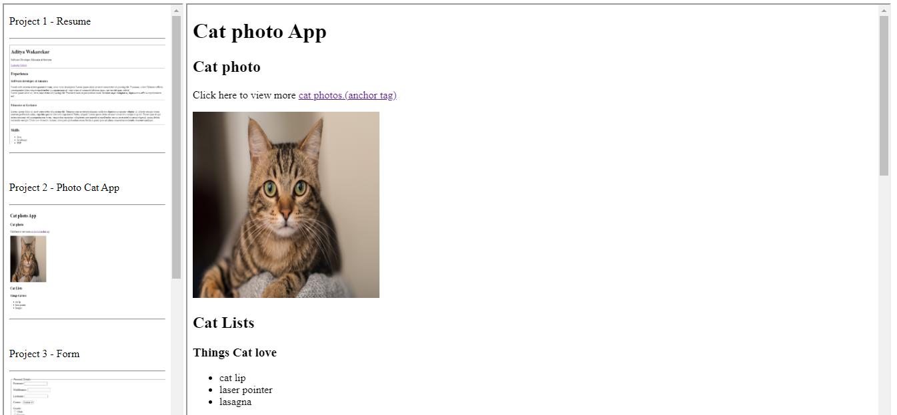

# Hosted Link
https://aditya7447.github.io/Weekly-Test-2/
#
In single HTML page two HTML pages are added using 'iframe' tag with the help of name attribute
>

#
This is panel.html page added in HTMl document using 'iframe' tag scr = 'panel.html' and attribute with name = frame1
>
Inside the panel.hmtl file I used 'hr','br','heading' tags are used and 'img' tag is used inside the 'a' anchor tag
>
In anchor tag href link is provied of github hosted page link which will redirect to another frame that is created using 'iframe' tag with attribute name = frame2
>

#
While clicking on the image of first frame that is panel.html page its redirect to another page and this redirect page is display in second iframe
>

